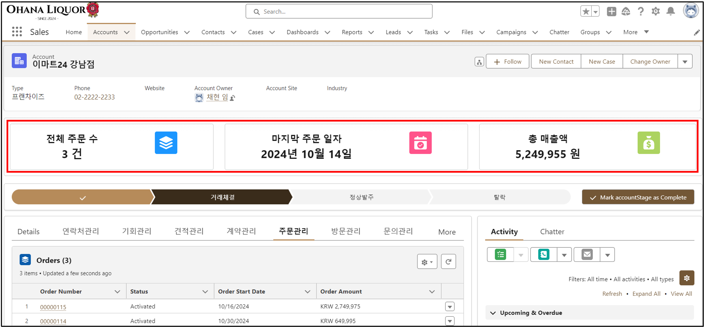

## 프로젝트 명
- Ohana Liquor CRM 도입 프로젝트
## 개요
- 가상 주류 회사인 Ohana Liquor에 Salesforce CRM 시스템 도입을 돕고 이를 통해 데이터 통합, 자동화 비즈니스 프로세스 정립

## 프로젝트 기간
- 2024.09.04 ~ 10.22 (약, 1달)

# 구현 기능 설명

## 1. Lead 관리 현황 파악 기능
### Paint-Point
- 빠른 대응이 이루어지지 않은 리드일수록 영업 기회로 전환될 확률이 낮아져 리드에 대해서 신속한 관리가 필요했지만 이를 위한 기능 부족
- 리드의 활동 상태나 관리 현황을 직관적으로 파악할 수 없어 즉각적인 대응의 어려움
### 구현기능
- Leads Object의 커스텀 필드를 생성하여 Home 대시보드, leads list view, lead record page 에서 직관적으로 Lead 활동 및 관리 상태 확인할 수 있도록 구현
- 커스텀 필드를 Green, Yellow, Red 이미지로 나타내서 직관적으로 상태를 파악하도록 구현

### 관련 Source Code
- [LeadSurveyTrigger](force-app/main/default/triggers/LeadSurveyTrigger.trigger)
- [leadTrigger](force-app/main/default/triggers/leadTrigger.trigger)
- [TaskTrigger](force-app/main/default/triggers/TaskTrigger.trigger)

### 1) Home 대시보드 차트

### 2) Leads list view 페이지

### 3) Leads record 페이지

## 2. 과도한 업무 Lead convert 제한 기능
### Paint-Point
- 특정 영업 사원에게 과도한 기회가 할당될 경우 고객 관리 품질 저하 발생으로 이어졌으며 이를 방지할 수 있는 기능 부재

### 구현기능
- 특정 영업 사원에게 과도한 업무 부여될 경우 validate 오류를 발생하게 하여 다른 영업 사원에게 할당하도록 수 있도록 구현

### 관련 Source Code
- [OpportunityTriggerHandler](force-app/main/default/classes/OpportunityTriggerHandler.cls)
- [OpportunityTriggerQuotaValidation](force-app/main/default/classes/OpportunityTriggerQuotaValidation.cls)
- [OpportunityTrigger](force-app/main/default/triggers/OpportunityTrigger.trigger)

### Lead Convert 시 할당 제한

## 3. Account Page의 주문 현황 요약 기능
### Paint-Point
- 특정 Account와 관련된 주문 현황을 한 눈에 파악하기 어려웠음
- 주문 수, 마지막 주문 일자, 총 매출액 등 핵심 정보를 확인하기 위해 여러 화면을 탐색해야 했고 이로 인해 업무 처리 속도가 지연

### 구현기능
- 관리자가 특정 Account 와 관련된 모든 주문 현황을 한눈에 시각적으로 파악하여 빠르게 업무 진행 할 수 있도록 구현

### 관련 Source Code
- [accountOrderStats](force-app/main/default/lwc/accountOrderStats)
- [AccountOrderController](force-app/main/default/classes/AccountOrderController.cls)

### 1) Order 현황 요약

### 2) 주문 수 클릭 시 List View Page 전환

## 4. 필드 영업 신규 수주 대시보드 
### Paint-Point
- 필드 영업의 성과 추이를 빠르게 확인할 수 있는 기능 부재로 전략 수립 및 성과 개선의 어려움
- 리포트 및 대시보드 제작하는데 많은 인력과 시간 투입으로 인해 비효율적인 업무 처리

### 구현기능
- 필드 영업의 수주 활동에 대해 모니터링할 수 있는 대시보드 제작

### 필드 영업 신규 수주 대시보드 

